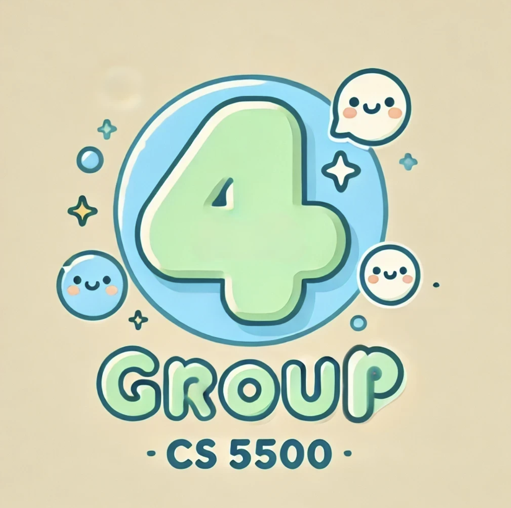
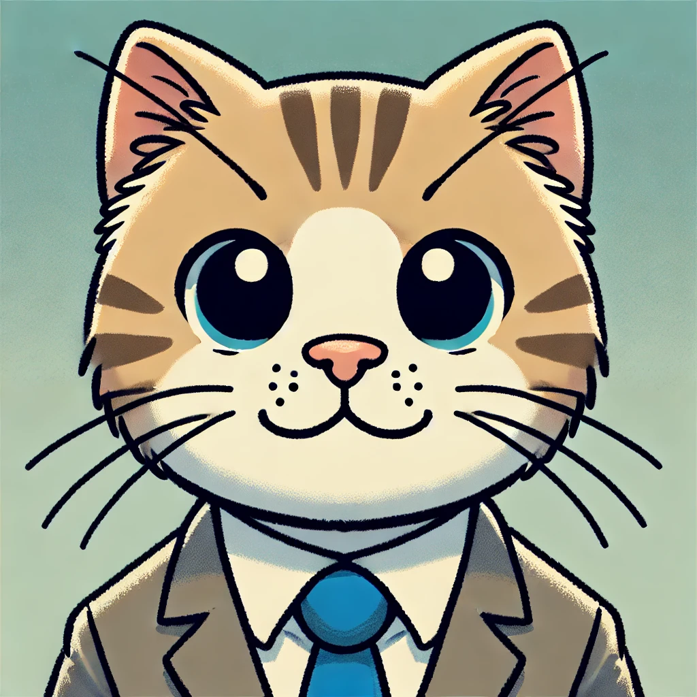
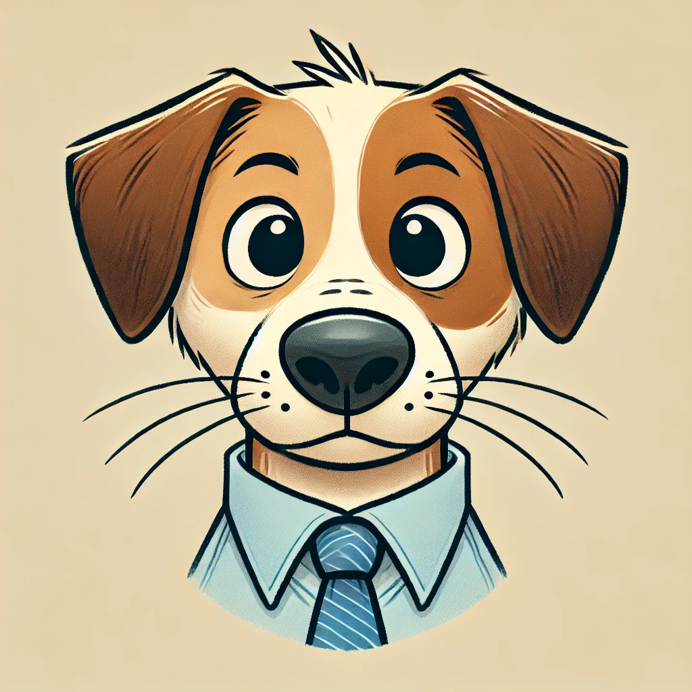
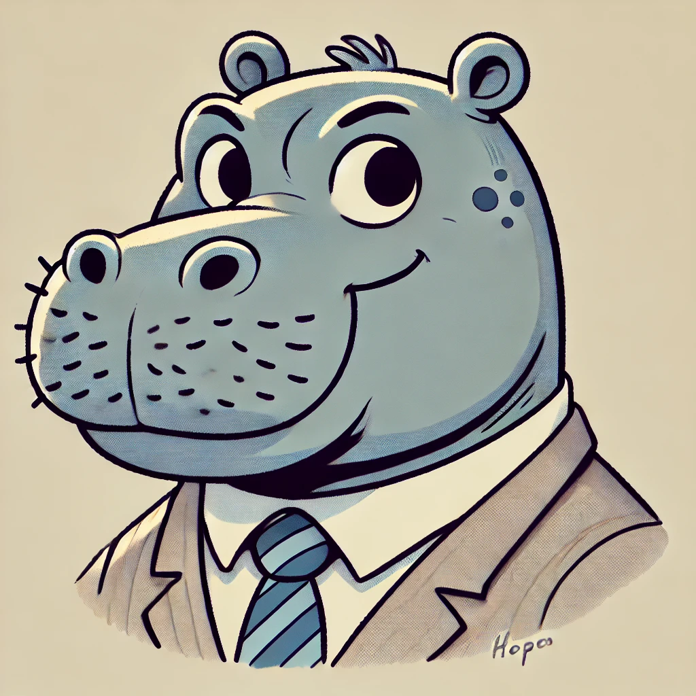
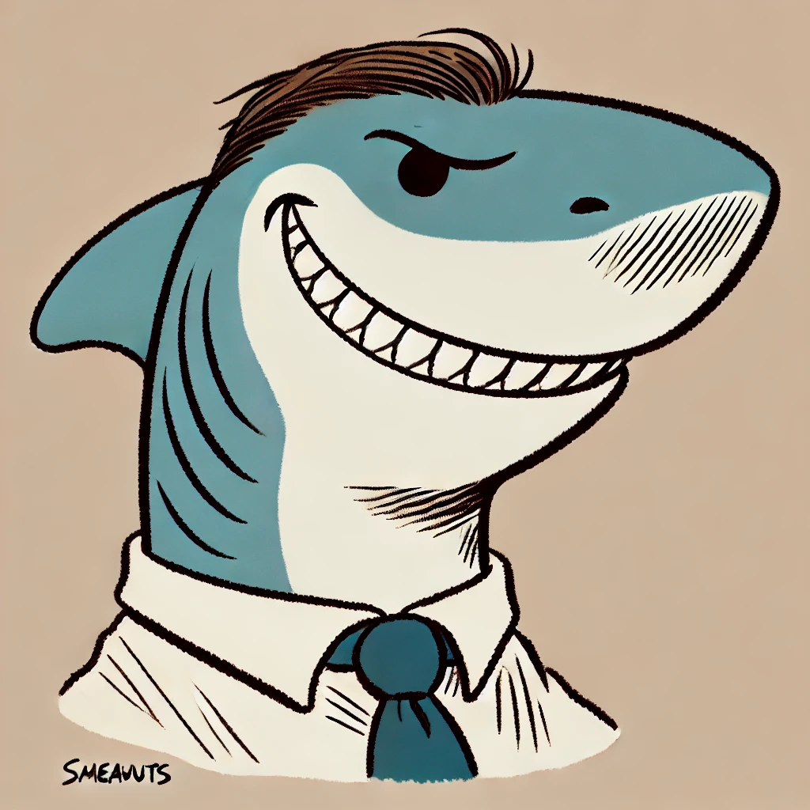
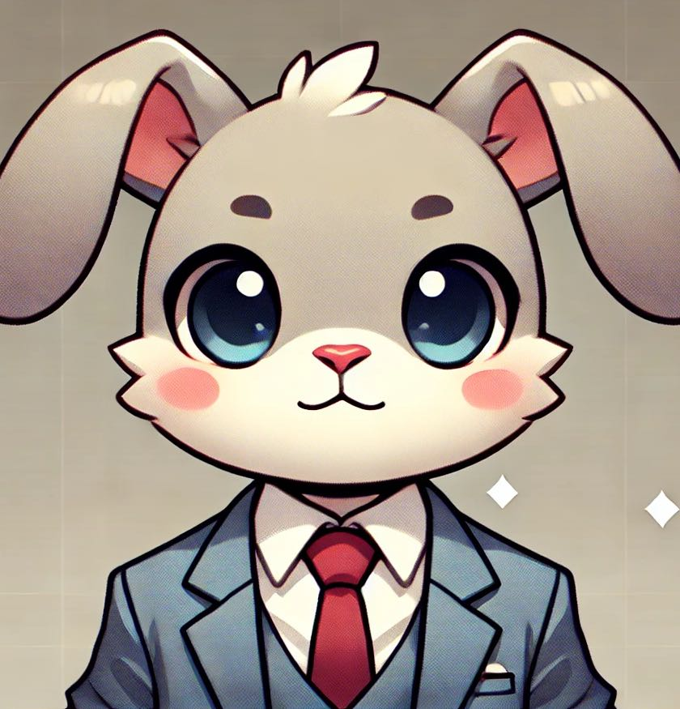
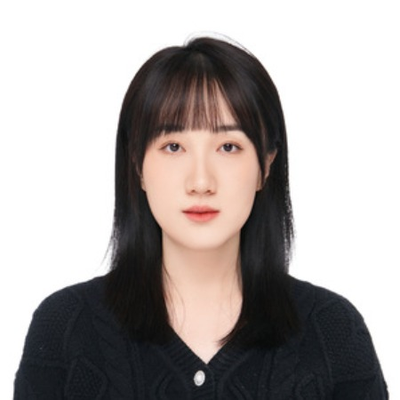

# CS 5500 Fall 2024 Group 4  Repository 

- **Team Name:** CS 5500 Group 4
- **Team Description:** CS 5500 Group 4 is a dynamic team of motivated students dedicated to applying their technical skills and creativity to make a positive impact. We are excited to take on the BC Cancer project, where we aim to develop innovative solutions to address real-world challenges faced by the Vancouver Cancer Association. Together, we strive to create solutions that not only meet project requirements but also make a positive contribution to the industry through our combined expertise.

## Team Members
| Image | Name | Email |
|-------|------|-------|
|  | Minghe Hu | hu.mingh@northeastern.edu |
|  | Rubing Li | li.rub@northeastern.edu |
|  | Dalin Wang | wang.dal@northeastern.edu |
|  | Yuning Mu | mu.yun@northeastern.edu |
|  | Meilin Niu | niu.me@northeastern.edu |

## Assigned TA
Your TA will be one of these:

| Image | Name | Email |
|-------|------|-------|
|  | Bella | xie.xinyu@northeastern.edu |
|  | Edward | Zhang.jiale2@northeastern.edu |

## Weekly Stand-Up Time
- [TBD: Place holder for the assigned time for the weekly stand up with TA]
